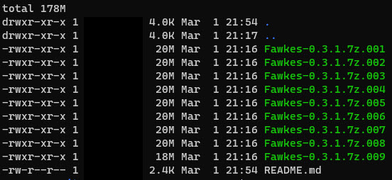

# MACOS DMG File - Compressed and split

This folder contains the main windows binary which has been compressed and split using
[7zip](https://www.7-zip.org/). 

# VirusTotal Scans for each file

N | File | MD5 Hash | VirusTotal Scan
--- | --- |--- | ---
1 | Fawkes-0.3.1.7z.001 | `e20e760d16bbb492f6811edb8dcfc9c1` |[SCAN]( https://www.virustotal.com/gui/url/bd5a79532a0ccf0194cac97f408de5abf6c99d5367bee99dffd4f7e70b58bf16/detection )
2 | Fawkes-0.3.1.7z.002 | `42539f86bb0bcaccfd6762ca6ae93f77` |[SCAN]( https://www.virustotal.com/gui/url/391ca286a3b1dbb16c74227c3d60b5d3993ea6b08fc69ffb497913d952ffdbf3/detection )
3 | Fawkes-0.3.1.7z.003 | `546b4abe1aa0c72da2576432a9924578` |[SCAN]( https://www.virustotal.com/gui/url/6197e70834aa739db9cdcd6145872ce59a327f4ab90a0b5aa7e68e5f953fc9fc/detection )
4 | Fawkes-0.3.1.7z.004 | `a02e08638f24a93cf13da1d68ccef029` |[SCAN]( https://www.virustotal.com/gui/url/f9e663b5ce473c765411eb10f3493df29fb161296436982aae540c53105451d4/detection )
5 | Fawkes-0.3.1.7z.005 | `260402502d9b7e6a724ec16e6b89534d` |[SCAN]( https://www.virustotal.com/gui/url/57c9437c819f85c15304489f07b7dd7c44bd321301b090c994fd540dcd6ac074/detection )
6 | Fawkes-0.3.1.7z.006 | `09004fd182fb1bd3149c95021e60f598` |[SCAN]( https://www.virustotal.com/gui/url/02b261c9fde0ad740b75d7346688aef6180766c4b8d277b05271de82dfdddbe1/detection )
7 | Fawkes-0.3.1.7z.007 | `7cd08a6f4ecdbc0518324300efc8f001` |[SCAN]( https://www.virustotal.com/gui/url/1ab5220e81dab1e441e6e6bb2185616f06b3637a29a042bbb8f33b91743f32f7/detection )
8 | Fawkes-0.3.1.7z.008 | `c91fa8af78ecb71ff2efe7afbafb437a` |[SCAN]( https://www.virustotal.com/gui/url/e6fbac97d35e31a6eac9ea0c637f9abb08878bc7a1f3a654be5e44455d548877/detection ) 
9 | Fawkes-0.3.1.7z.009 | `cc1511e23f36914be91035d16066ef5e` |[SCAN]( https://www.virustotal.com/gui/url/29cf494b2383a46caa5848ffff2849fd367fd48fb9e71745dc4bee1d176d0c5d/detection )

Filehashes can be confirmed usign this online tool -> [MD5CHECK](https://emn178.github.io/online-tools/md5_checksum.html)

# Install 

Step 1 - Either download or clone this repo

Steo 2 - Install [UNARCHIVER](https://apps.apple.com/us/app/the-unarchiver/id425424353?mt=12) 

Step 3 - Unzip Fawkes-0.3.1.7z.001 and all 9 files files will be used to decompress to DMG

Step 4 - Double click to install 

# Compatibility 

MacOS 10.13
MacOS 10.14
MacOS 10.15
MacOS 11.00

# Source

http://sandlab.cs.uchicago.edu/fawkes/
