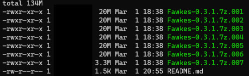

# Windows EXE - Compressed and split

This folder contains the main windows binary which has been compressed and split using
[7zip](https://www.7-zip.org/). 

# VirusTotal Scans for each file

N | File | MD5 Hash | VirusTotal Scan
--- | --- |--- | ---
1 | Fawkes-0.3.1.7z.001 | `27c6570518b7e40c8e1f1f48f4866595` |[SCAN](https://www.virustotal.com/gui/url/6f219b4ed71377354445a501c8204775170bcc76898a2ecf6a687c686aab3dc5/detection)
2 | Fawkes-0.3.1.7z.002 | `317982d1a5de5be83202eec6232b6f07` |[SCAN](https://www.virustotal.com/gui/url/96eb089b5ac34d9575060bce6f04aebb0b9467312799ce34505bbb382b0e0aa6/detection)
3 | Fawkes-0.3.1.7z.003 | `a6081e88b2170c41365f1276dc35fa20` |[SCAN](https://www.virustotal.com/gui/url/00bab59f0ad996d4b753a665e9d9739c555343c584f8f282c5498b20b74aa89f/detection)
4 | Fawkes-0.3.1.7z.004 | `9788fa34a23c9ca263c1cfec71e6fa0a` |[SCAN](https://www.virustotal.com/gui/url/f9d638008c1e95c8b0c401ba1e375a48cb60d859dfbcad6fd9b74256c78b8dc4/detection)
5 | Fawkes-0.3.1.7z.005 | `27b66e7bfa93afa259df252b99175afa` |[SCAN](https://www.virustotal.com/gui/url/9d5867d685e31afa1c5ff06c1e49c5892f9b6a3d72f7f89e5f3fef926802956c/detection)
6 | Fawkes-0.3.1.7z.006 | `e42a3d2e83736a49d4f6a40b63947535` |[SCAN](https://www.virustotal.com/gui/url/047504fad35b5c9dab185c04dfec5406d2b04becef3ee6278a1395df84046406/detection)
7 | Fawkes-0.3.1.7z.007 | `13eeb544d0ddcde0db056ee4f4770951` |[SCAN](https://www.virustotal.com/gui/url/9a387b332385aa91bafe431d2b0a0e525d41e6fb72f6af8d890261c7dcbd664b/detection)

Filehashes can be confirmed usign this online tool -> [MD5CHECK](https://emn178.github.io/online-tools/md5_checksum.html)

# Install 

Step 1 - Either download or clone this repo

Steo 2 - Install [7zip](https://www.7-zip.org/) 

Step 3 - Unzip Fawkes-0.3.1.7z.001 and all 7 files files will be used to decompress to main exe

Step 4 - Double click to install 

# Compatibility 

Windows Version - Windows 10 and above only 

# Source

> http://sandlab.cs.uchicago.edu/fawkes/
